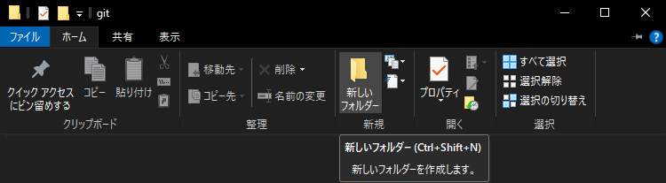
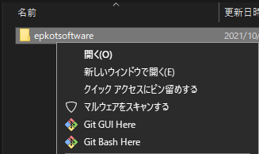
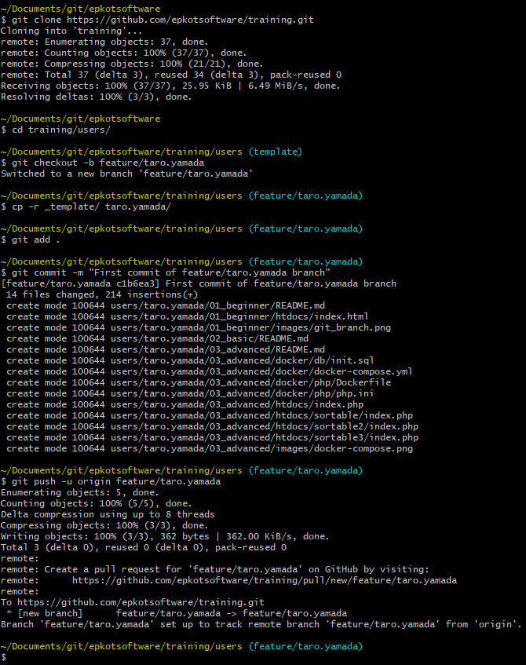
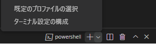
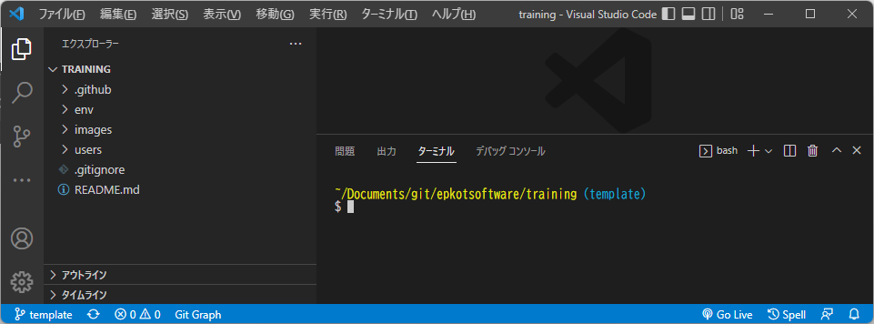
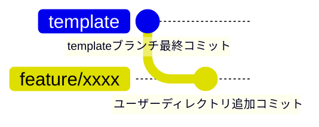
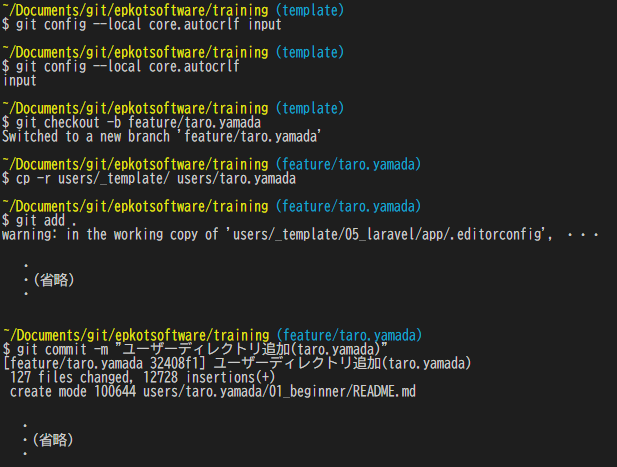

# 研修用リポジトリ

## ユーザー名

各説明に出てくる「`{★ユーザー名}`」は自分のエプコットメールアドレスのユーザー名（@マークの左）を使ってください。

- メールアドレス `"taro.yamada@epkotsoftware.co.jp"` の例
  - `{★ユーザー名}`: `taro.yamada`
    - ブランチ名: `feature/taro.yamada`
    - ユーザーディレクトリ名: `taro.yamada`

## 注意

- 環境構築を行うフォルダー（git cloneするディレクトリ）はクラウドストレージの**管理外**のフォルダー(ディレクトリ)内で行ってください。
  - Windowsの場合は「OneDrive」、OneDriveのアイコンがついていない場所にする。
    - まるに緑チェックなに？｜OneDrive-アイコンの意味
      - <https://pc119.toyama.jp/work/%E3%81%BE%E3%82%8B%E3%81%AB%E7%B7%91%E3%83%81%E3%82%A7%E3%83%83%E3%82%AF%E3%81%AA%E3%81%AB%EF%BC%9F%EF%BD%9Conedrive-%E3%82%A2%E3%82%A4%E3%82%B3%E3%83%B3%E3%81%AE%E6%84%8F%E5%91%B3/>
    - デスクトップ等もOneDrive管理になりますのでご注意ください。
    - よくわからない場合、「`C:\Users\{自分のWindowsユーザー名}\Documents`」配下に作ることをおすすめします。
  - Macの場合は「iCloud Drive」、iCloudを使用していない場所にする。
    - <https://support.apple.com/ja-jp/HT204025>
  - その他のクラウドストレージ、ご自身で設定しているはずなので説明は割愛します。
    - Nextcloud
    - Dropbox
    - Google ドライブ

## 環境構築

- Windows での例
  - 任意の場所に「`epkotsoftware`」フォルダー（ディレクトリ）を作成します。
    - 例: `C:\Users\{Windowsユーザー名}\Documents\git\epkotsoftware`  
    
  - 作成したフォルダーを右クリックし、「`Git Bash Here`」を選択してください。  
    
- Mac での例
  - 任意の場所に「`epkotsoftware`」フォルダー（ディレクトリ）を作成します。
    - 例: `/Users/{Macユーザー名}/git/epkotsoftware`
    - 参考: Finderでホームを表示
      - <https://dtmmethod.com/mac-finder-home>
  - 作成したフォルダーのメニューを出し、「`フォルダに新規ターミナル`」を選択してください。  

GitBash(ターミナル)で`pwd`コマンドを入力してEnterを押すと  
現在のフォルダー(ディレクトリ)のパスが見れます。  
末端が「**epkotsoftware**」になっていることを確認しましょう。  

```bash
epkot@epkot epkotsoftware % # Macのターミナルの例
epkot@epkot epkotsoftware % pwd
/Users/epkot/git/epkotsoftware
epkot@epkot epkotsoftware % 
```

### リポジトリクローン

GitBash(Windows)またはターミナル(Mac)でコマンドを1行ずつ入力してEnterを押してください（`#`から始まっているコメントは不要）。  

※ **GitBashアプリの場合、コマンドをペーストするショートカットキーが `Ctrl+V` ではないので**  
  **右クリックメニューの「Paste」で貼り付けてください。**  

初めてgitを触る場合、トークンの入力が求められるので準備してください。  

- トークンの準備（他者には見せないようにご注意ください）
  - <https://epkotsoftware.github.io/github/#トークン>

トークンの準備が出来たら以下のコマンドを実行します。  
実行後トークンの入力が求められるかと思います。  

```bash
# GitHubのリポジトリをローカルに複製
git clone https://github.com/epkotsoftware/training.git
```

---

WindowsのGitBashで実行した例  
  

---

GitBash(ターミナル)は閉じましょう。

### VSCodeで開く

- VSCodeで「training」を開く
  - VSCodeを開き「フォルダーを開く」から「git/epkotsoftware」フォルダー内の「**training**」フォルダを選択
- ターミナルを表示
  - メニューバー「表示」→「ターミナル」
- 既定のターミナルを変更 (Windows)
  - 「既定のプロファイルの選択」→ 「Git Bash」を選択  
       
  - 「+」アイコンでターミナルを出すとターミナルとしてGitBashが使われるようになる。

---

以下のような表示になります(Windows例)。

  

---

### ユーザーブランチ・ディレクトリ作成

ユーザーブランチ及び、ユーザーディレクトリ(フォルダー)を作成します  



VSCodeのターミナルでコマンドを1行ずつ打っていきます。

---

- `{★ユーザー名}`はルールが決まっていますのでご注意ください（[ユーザー名](#ユーザー名)参照）  
  ※ **「{」、「}」をブランチ名やディレクトリ名に含める人が多いですが不要です。**
  - 例
    - ブランチ名: `feature/taro.yamada`
    - ユーザーディレクトリ名: `taro.yamada`

```bash
# パスの確認 「epkotsoftware/training」が含まれること
pwd
# Gitコンフィグ設定（core.autocrlf に「input」を設定）
git config --local core.autocrlf input
# Gitコンフィグ設定確認（「input」が表示されること）
git config --local core.autocrlf
# 現在のブランチから、ユーザーブランチを作成してチェックアウト
#   ブランチ名例: feature/taro.yamada
git checkout -b feature/{★ユーザー名}
# training/users/_template ディレクトリを training/users/{★ユーザー名} にコピー
#   ユーザーディレクトリパス例: `users/taro.yamada`
cp -r users/_template/ users/{★ユーザー名}
# コピーしたディレクトリをステージング (warningが出ることがありますが無視でOKです)
git add .
# ステージングしたファイルをコミット
git commit -m "★任意のコメント"
```

- 実行例 (ユーザー名: taro.yamada　の場合)
    

---

ここまでの手順で「[epkotsoftware/training/users/{★ユーザー名}](./users/)」にフォルダーが出来ていることを確認してください。  
問題なければ、以下のコマンドでpushします。

---

```bash
# GitHubへ作成したブランチを公開
#   ブランチ名例: feature/taro.yamada
git push -u origin feature/{★ユーザー名}
```

- コマンド例 (ユーザー名: taro.yamada　の場合)
  - `git push -u origin feature/taro.yamada`

---

これでGitHubにアップされているので確認しましょう。

- 確認
  - 作成したブランチがGitHub上に出来ているか確認してください。
    - <https://github.com/epkotsoftware/training/branches/yours>

## 禁止事項

- [users](./users/)の自分のユーザーディレクト以外の変更を禁止します。
  - [users/README.md](./users/README.md) にも記載しています。

## 社内開発

研修終了後（自己学習）に社内で開発しているシステム（提案止まり含む）の  
リポジトリにアクセス出来るようになります。  

- 技術者マッチングサイトの開発
  - <https://github.com/epkotsoftware/dev-it-matching>
- 勤怠管理・労務管理システムの開発（社内システム）
  - <https://github.com/epkotsoftware/internal-system>
  - 別会社の勤怠システムも参考になります。
    - デモサイト
      - `Web勤怠システム オツトメ！ ログイン`
        - <https://demo.otsutome.net/demo/login>
      - `MosP(モスプ) デモサイト 勤怠管理`
        - <https://mosp.jp/?page_id=66>
      - `RecoRu - レコルデモサイト`
        - <https://demo.recoru.in/ap/demo/?utm_source=recoru_hp&utm_medium=referral&utm_campaign=header_to_demo>
    - 操作マニュアル
      - `Web勤怠システム オツトメ！ チュートリアル`
        - <https://otsutome.net/tutorial#index-1>
      - `MosP(モスプ) 資料ダウンロードページ`
        - <https://mosp.jp/?page_id=219>
      - `RecoRu - レコルオンラインマニュアル`
        - <https://app.recoru.in/manual/index.html>
      - `intra-mart Accel Kaiden! 勤務管理 / ユーザ操作ガイド`
        - <https://document.intra-mart.jp/library/iak/public/kaiden_labormgr_user_guide/index.html>
      - `intra-mart Accel Kaiden! 勤務管理 / 管理者操作ガイド 5. マスタ設定`
        - <https://document.intra-mart.jp/library/iak/public/kaiden_labormgr_administrator_guide/texts/master/index.html>
- アンケートサイト
  - アンケートサイトはアンケート内容を変更するだけなので  
    助成金申請向けWeb診断サイトの画面イメージや、様々なアンケート調査結果を参考にしてください。
  - 対象
    - 助成金申請向けWeb診断サイトの開発
    - 生命保険会社向けデータ集計機能の開発
    - 金融機関向け住宅ローン利用状況集計システムの改修
    - 証券会社利用分析システムの改修
  - 情報
    - 助成金申請向けWeb診断サイトの開発（画面イメージ・モックあり）
      - <https://github.com/epkotsoftware/dev-subsidy>
    - 住宅ローンの利用に関するアンケート調査（第8回）
      - <https://myel.myvoice.jp/products/detail.php?product_id=22512>
    - 生命保険の加入実態に関するアンケート調査（第12回）
      - <https://myel.myvoice.jp/products/detail.php?product_id=28809>
    - 証券会社の利用に関するアンケート調査（第8回）
      - <https://myel.myvoice.jp/products/detail.php?product_id=25907>
    - 貯金に関するアンケート調査
      - <https://myel.myvoice.jp/products/detail.php?product_id=17310>
- 薬剤師会向けWeb報告システムの開発
  - <https://github.com/epkotsoftware/dev-proposal/tree/main/pre-avoid>
- 顧客管理システムの開発
  - <https://github.com/epkotsoftware/dev-proposal/tree/main/dev-survey-management-system>
- 英文試験問題生成プログラムの開発
  - <https://github.com/epkotsoftware/dev-proposal/tree/main/dev-testmaker>

設計書のテンプレートは、以下に入っています。  
内部開発案件の設計書を試しに作ってみましょう。

- 設計書のテンプレート・例
  - <https://github.com/epkotsoftware/dev-proposal/tree/main/template/docs>
