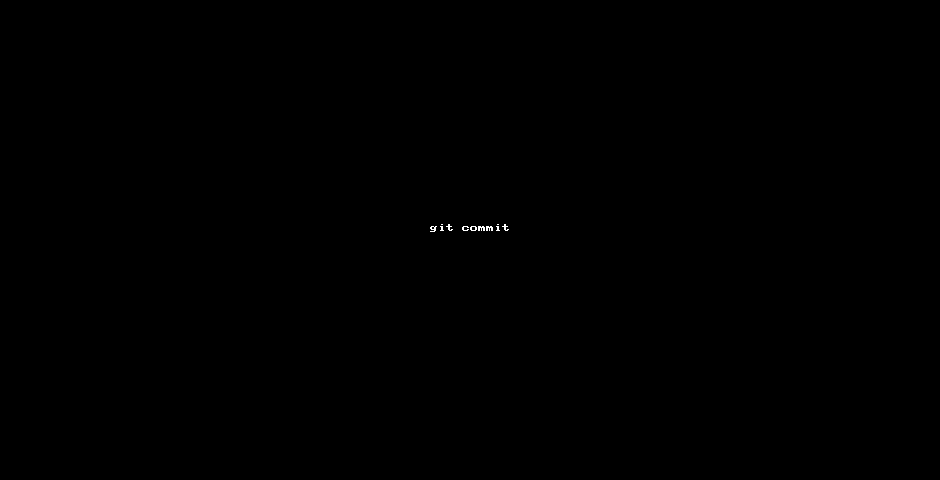
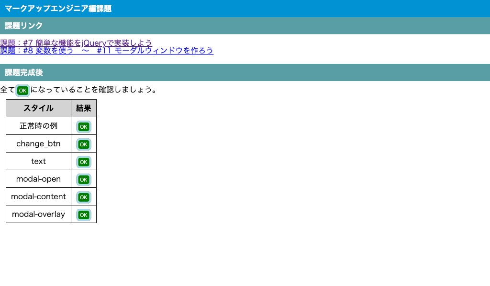
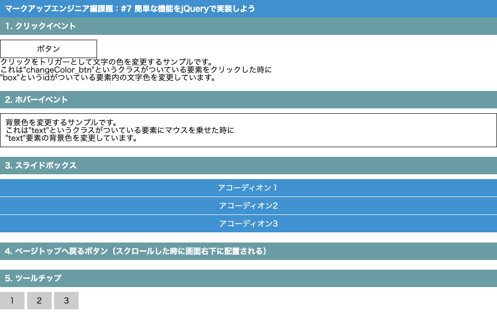
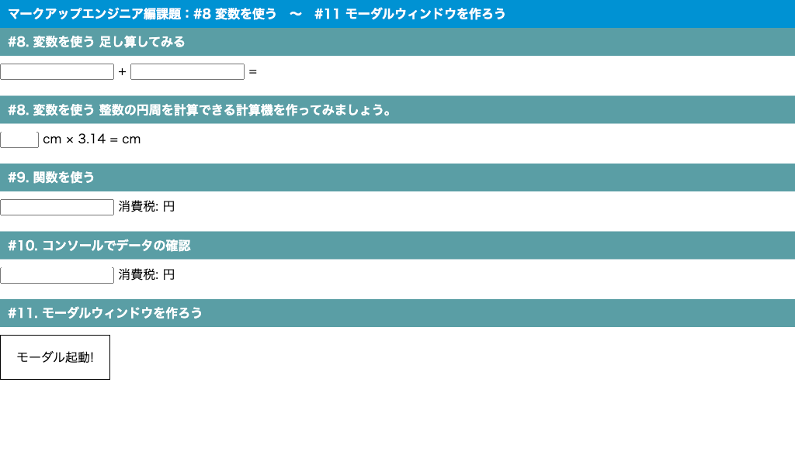

# 研修課題提出

| No. |  |
| --- | --- |
| 1 | [コミットルール](#コミットルール) |
| 2 | [VSCodeでの課題提出例](#vscodeでの課題提出例) |
| 3 | [コーダー編課題](#コーダー編課題) |
| 4 | [マークアップエンジニア編課題](#マークアップエンジニア編課題) |
| 5 | [フロントエンドエンジニア編課題](#フロントエンドエンジニア編課題) |

## コミットルール

- [users](./../../users/)内の自分のユーザーディレクトリ以外の変更を禁止します。
- GitHub上でのコミット禁止（GitHubは現場で使われていない所もあり、Git学習を兼ねているため）
- 不要なファイル(使用されていないファイル)がコミットされていないこと
- VSCode・GitBash(macOSの場合、ターミナル)を使ってコミットすること
- コミットのコメントが適切にされていること
- コミットの目的と関係ないファイルはコミットしないこと  
  コーダー編、マークアップエンジニア編のファイルを混ぜてコミットする等

## VSCodeでの課題提出例

VSCodeを使用した提出例です。

1. 「`ソース管理`」アイコンをクリック
1. 「`ツリーとして表示`」アイコンをクリックし、アップするファイルに間違いがないか確認する。
1. コミット対象ファイル・フォルダの「`+`」アイコン(変更をステージ)をクリックし、ステージする。  
  **※ 対象外のファイルはステージしないこと**
1. コミットメッセージを入力
1. 「`コミット`」アイコンをクリックし、ステージしたファイルをコミットする。
1. 「`git push`」コマンドでコミットした内容をGitHubへ反映する。
1. GitHubでコミットが反映されたか確認する  
  <https://github.com/epkotsoftware/training/commits/>

---

## コーダー編課題

### コーダー編課題アップロード先

| 対象 | アップ先 |
| --- | --- |
| コーダー編課題 | `users/自分のユーザー名/01_beginner/htdocs/` |

### コーダー編課題チェックリスト

コミット前のチェックリストです。

- コミット前のチェック
  - [コミットルール](#コミットルール)を確認していること
  - [VSCodeでの課題提出例](#vscodeでの課題提出例)を参考にアップすること
  - `01_beginner/htdocs` 内のファイルのみコミットを行うこと
    - 使用している画像もコミット対象とすること
    - 使用しているCSSもコミット対象とすること
  - ページが要件通り作られていること
    - 自分のユーザーディレクトリの「`01_beginner/htdocs/index.html`」をブラウザで開くと、作成したページが見れること
    - Google Chrome で見れること
    - 横幅:`1024px` で表示が崩れないこと
    - 横幅:`1024px` で横スクロールが出来ないこと

---

## マークアップエンジニア編課題

### マークアップエンジニア編課題アップロード先

| 対象 | アップ先 |
| --- | --- |
| Excel(売上表・成績表) | `users/自分のユーザー名/02_basic/excel/kadai.xlsx` |
| jQuery(#7 簡単な機能をjQueryで実装しよう) | `users/自分のユーザー名/02_basic/htdocs/kadai_07.html` |
| jQuery(#8 変数を使う 〜 #11 モーダルウィンドウを作ろう) | `users/自分のユーザー名/02_basic/htdocs/kadai_08.html` |

### マークアップエンジニア編課題チェックリスト

コミット前のチェックリストです。

- [コミットルール](#コミットルール)を確認していること
- [VSCodeでの課題提出例](#vscodeでの課題提出例)を参考にアップすること
- `02_basic` 内のファイルのみコミットを行うこと
- `02_basic/htdocs/css/reset.css` が変更されていないこと
- `02_basic/htdocs/css/common.css` にページ固有のスタイルが入っていないこと
  - 例えばモーダル関連のスタイルや `#change_btn` 等
- TODOコメントが全て削除されていること
- `kadai_07.html` 用のJavaScriptおよびスタイルが他ページに適用されないこと
- `kadai_08.html` 用のJavaScriptおよびスタイルが他ページに適用されないこと
- 全ページのデザインが統一されていること

画面表示例です。  

- `02_basic/htdocs/index.html`  
    
- `02_basic/htdocs/kadai_07.html`  
    
- `02_basic/htdocs/kadai_08.html`  
    

---

## フロントエンドエンジニア編課題

### フロントエンドエンジニア編課題アップロード先

| 対象 | アップ先 |
| --- | --- |
| #1 PHPとjsで簡単なアプリを作ってみよう 〜 | `users/自分のユーザー名/03_advanced/htdocs/` |
| #11 PHPでClassクラスを理解するための準備 | `users/自分のユーザー名/03_advanced/htdocs/sortable2/` |
| #12 PHPアプリケーションをクラス化してみよう | `users/自分のユーザー名/03_advanced/htdocs/sortable3/` |
| 任意課題 | `users/自分のユーザー名/03_advanced/htdocs/epkot/` |

※ 任意課題については、研修が遅れている場合は飛ばしてください。

### フロントエンドエンジニア編課題チェックリスト

コミット前のチェックリストです。

- [コミットルール](#コミットルール)を確認していること
- [VSCodeでの課題提出例](#vscodeでの課題提出例)を参考にアップすること
- `03_advanced` 内のファイルのみコミットを行うこと
- `03_advanced/htdocs/index.php` (`#1 PHPとjsで簡単なアプリを作ってみよう 〜`)
  - 登録ボタン
    - 男性での登録が可能なこと
    - 女性での登録が可能なこと
  - ドラッグ
    - 移動することが出来、DBも更新されること
- `03_advanced/htdocs/sortable2/index.php` (`#11 PHPでClassクラスを理解するための準備`)
  - 登録ボタン
    - 男性での登録が可能なこと
    - 女性での登録が可能なこと
  - ドラッグ
    - 移動することが出来、DBも更新されること
- `03_advanced/htdocs/sortable3/index.php` (`#12 PHPアプリケーションをクラス化してみよう`)
  - 登録ボタン
    - 男性での登録が可能なこと
    - 女性での登録が可能なこと
  - ドラッグ
    - 移動することが出来、DBも更新されること

**※ CBCのソースコードのコピーではうまくいかない部分もあるので、レビュー依頼前に自身でテストしましょう。**

---

## バックエンド編課題

### バックエンド編課題アップロード先

| 対象 | アップ先 |
| --- | --- |
| バックエンド編課題 | `users/自分のユーザー名/05_laravel/app/` |

### バックエンド編課題チェックリスト

コミット前のチェックリストです。

- [コミットルール](#コミットルール)を確認していること
- [VSCodeでの課題提出例](#vscodeでの課題提出例)を参考にアップすること
- `05_laravel` 内のファイルのみコミットを行うこと
- 対象機能
  - 【Sortable】 移植した画面が動作していること（タスク管理ツールの追加で動作しなくなる方が多いです）
  - 【Task】「タスク管理ツール」が動作していること
    - ルーティングに関しては、Sortableにdelete等が追加されることも想定すること

**※ CBCのソースコードのコピーではうまくいかない部分もあるので、レビュー依頼前に自身でテストしましょう。**
