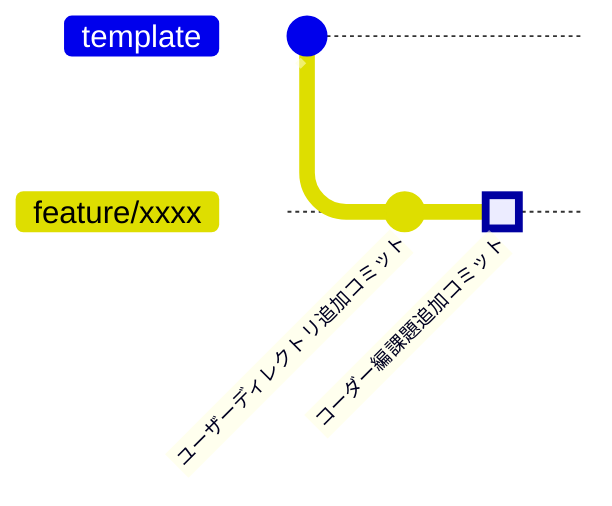
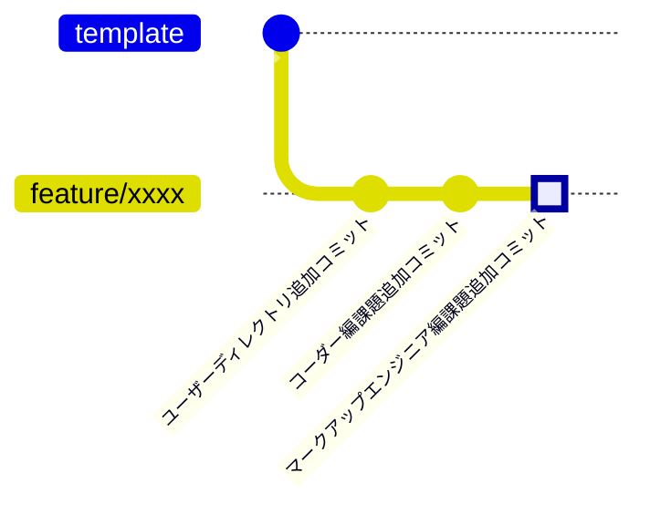
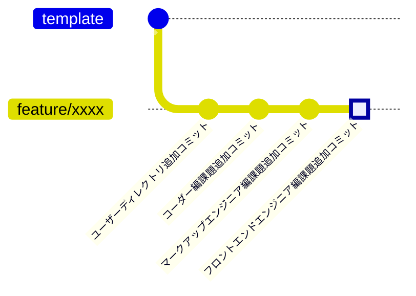
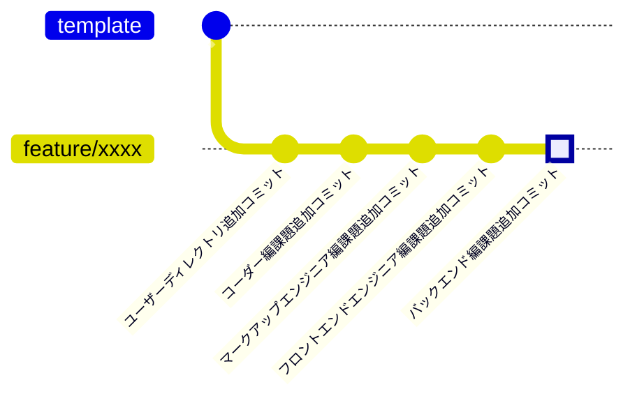
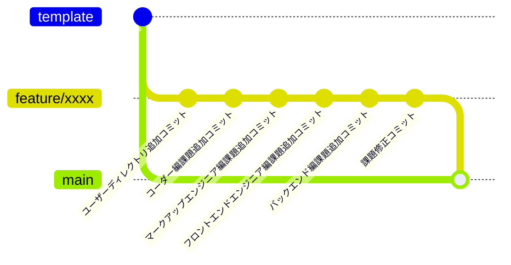

# 研修課題提出

| No. |  |
| --- | --- |
| 1 | [各チェックリストの目的](#各チェックリストの目的) |
| 2 | [コミットルール](#コミットルール) |
| 3 | [VSCodeでの課題提出例](#vscodeでの課題提出例) |
| 4 | [コーダー編課題](#コーダー編課題) |
| 5 | [マークアップエンジニア編課題](#マークアップエンジニア編課題) |
| 6 | [フロントエンドエンジニア編課題](#フロントエンドエンジニア編課題) |
| 7 | [バックエンド編課題](#バックエンド編課題) |
| 8 | [バージョン管理システム編課題](#バージョン管理システム編課題) |

## 各チェックリストの目的

エンジニアに必須なテストを行う練習のため  
各課題にチェックリストを設けています。  

システムをリリースするつもりでチェックをしましょう。  
わからないチェック内容については、課題提出前に研修講師に確認しましょう。

## コミットルール

- [users](./../../users/)内の自分のユーザーディレクトリ以外の変更を禁止します。
- GitHub上でのコミット禁止（GitHubは現場で使われていない所もあり、Git学習を兼ねているため）
- 不要なファイル(使用されていないファイル)がコミットされていないこと
- VSCode・GitBash(macOSの場合、ターミナル)を使ってコミットすること
- コミットのコメントが適切にされていること
  - 例1： 「コーダー編課題提出」
  - 例2： 「コーダー編課題指摘修正」
  - 例3： 「マークアップエンジニア編Excel課題提出」
- コミットの目的と関係ないファイルはコミットしないこと  
  （コーダー編、マークアップエンジニア編のファイルを混ぜてコミットするなど）

## VSCodeでの課題提出例

VSCodeを使用した提出例です。

1. 「`ソース管理`」アイコンをクリック
1. 「`ツリーとして表示`」アイコンをクリックし、アップするファイルに間違いがないか確認する。
1. コミット対象ファイル・フォルダの「`+`」アイコン(変更をステージ)をクリックし、ステージする。  
  **※ 対象外のファイルはステージしないこと**
1. コミットメッセージを入力
1. 「`コミット`」アイコンをクリックし、ステージしたファイルをコミットする。
1. 「`git push`」コマンドでコミットした内容をGitHubへ反映する。
1. GitHubでコミットが反映されたか確認する  
  <https://github.com/epkotsoftware/training/commits/>


---

## コーダー編課題

### コーダー編課題アップロード先

| 対象 | アップ先 |
| --- | --- |
| コーダー編課題 | `users/自分のユーザー名/01_beginner/htdocs/` |

### コーダー編課題チェックリスト

コミット前のチェックリストです。  
※ 目的については「[各チェックリストの目的](#各チェックリストの目的)」を参照

- コミット前のチェック
  - [コミットルール](#コミットルール)を確認していること
  - 正しくファイルが格納されており、保存されているか（編集中のファイルはないか）確認すること
    - 「`01_beginner/htdocs/index.html`」ファイルの`img`, `link`タグに「`http`」から始まるアドレスや、絶対パスが入っていないこと。
    - 「`01_beginner/htdocs/css`」フォルダに使用しているCSSファイルが全て入っていること
    - 「`01_beginner/htdocs/images`」フォルダに使用している画像ファイルが全て入っていること
  - [VSCodeでの課題提出例](#vscodeでの課題提出例)を参考にアップすること
    - 「`01_beginner/htdocs`」フォルダ内のファイルのみコミットを行うこと
      - 「`01_beginner/htdocs/css`」フォルダ内のCSSファイルもコミット対象とすること
      - 「`01_beginner/htdocs/images`」フォルダ内の画像ファイルもコミット対象とすること
      - 不要なファイルは対象にしないこと
  - ページが要件通り作られていること
    - 自分のユーザーディレクトリの「`01_beginner/htdocs/index.html`」をブラウザで開くと、作成したページが見れること
    - Google Chrome で見れること
    - 横幅:`1024px` で表示が崩れないこと
      - 文字が切れていないこと
      - 画像がはみ出していないこと
    - 横幅:`1024px` で横スクロールが出来ないこと



---

## マークアップエンジニア編課題

### マークアップエンジニア編課題アップロード先

| 対象 | アップ先 |
| --- | --- |
| Excel(売上表・成績表) | `users/自分のユーザー名/02_basic/excel/kadai.xlsx` |
| jQuery(#7 簡単な機能をjQueryで実装しよう) | `users/自分のユーザー名/02_basic/htdocs/kadai_07.html` |
| jQuery(#8 変数を使う 〜 #11 モーダルウィンドウを作ろう) | `users/自分のユーザー名/02_basic/htdocs/kadai_08.html` |

### マークアップエンジニア編課題チェックリスト

コミット前のチェックリストです。  
※ 目的については「[各チェックリストの目的](#各チェックリストの目的)」を参照

- [コミットルール](#コミットルール)を確認していること
- [VSCodeでの課題提出例](#vscodeでの課題提出例)を参考にアップすること
- `02_basic` 内のファイルのみコミットを行うこと
- Excel課題
  - ファイル名が `kadai.xlsx` になっていること
  - 「売上管理票」のP列まで条件式が入っていること
  - 「成績表」の条件式に誤りがないこと
- jQuery課題
  - `02_basic/htdocs/css/reset.css` が変更されていないこと
  - `02_basic/htdocs/css/common.css` にページ固有のスタイルが入っていないこと
    - 例えばモーダル関連のスタイルや `#change_btn` など
  - TODOコメントが全て削除されていること
  - `kadai_07.html` 用のJavaScriptおよびスタイルが他ページに適用されないこと
  - `kadai_08.html` 用のJavaScriptおよびスタイルが他ページに適用されないこと
  - 全ページのデザインが統一されていること

jQuery課題の画面表示例です。  

- `02_basic/htdocs/index.html`  
    
- `02_basic/htdocs/kadai_07.html`  
    
- `02_basic/htdocs/kadai_08.html`  
    



---

## フロントエンドエンジニア編課題

### フロントエンドエンジニア編課題アップロード先

| 対象 | アップ先 |
| --- | --- |
| #1 PHPとjsで簡単なアプリを作ってみよう 〜 | `users/自分のユーザー名/03_advanced/htdocs/` |
| #11 PHPでClassクラスを理解するための準備 | `users/自分のユーザー名/03_advanced/htdocs/sortable2/` |
| #12 PHPアプリケーションをクラス化してみよう | `users/自分のユーザー名/03_advanced/htdocs/sortable3/` |
| 任意課題 | `users/自分のユーザー名/03_advanced/htdocs/epkot/` |

※ 任意課題については、研修が遅れている場合は飛ばしてください。

### フロントエンドエンジニア編課題チェックリスト

コミット前のチェックリストです。  
※ 目的については「[各チェックリストの目的](#各チェックリストの目的)」を参照

- [コミットルール](#コミットルール)を確認していること
- [VSCodeでの課題提出例](#vscodeでの課題提出例)を参考にアップすること
- `03_advanced` 内のファイルのみコミットを行うこと
- 以下のテスト項目が満たせていること
  - **※ CBCのソースコードのコピーではうまくいかない部分もあるので、レビュー依頼前に自身でテストしましょう。**

| 画面 | テスト項目 |
| --- | --- |
| `03_advanced/htdocs/index.php`<br>(`#1 PHPとjsで簡単なアプリを作ってみよう 〜`) | 【表示】余計なコメントなどが画面上に表示されていないこと |
| 〃 | 【表示】男性・女性で見た目が分かれていること |
| 〃 | 【登録ボタン】男性での登録が可能なこと |
| 〃 | 【登録ボタン】女性での登録が可能なこと |
| 〃 | 【ドラッグ】移動することが出来、DBも更新されること |
| `03_advanced/htdocs/sortable2/index.php`<br>(`#11 PHPでClassクラスを理解するための準備`) | 【表示】余計なコメントなどが画面上に表示されていないこと |
| 〃 | 【表示】男性・女性で見た目が分かれていること |
| 〃 | 【登録ボタン】男性での登録が可能なこと |
| 〃 | 【登録ボタン】女性での登録が可能なこと |
| 〃 | 【ドラッグ】移動することが出来、DBも更新されること |
| `03_advanced/htdocs/sortable3/index.php`<br>(`#12 PHPアプリケーションをクラス化してみよう`) | 【表示】余計なコメントなどが画面上に表示されていないこと |
| 〃 | 【表示】男性・女性で見た目が分かれていること |
| 〃 | 【登録ボタン】男性での登録が可能なこと |
| 〃 | 【登録ボタン】女性での登録が可能なこと |
| 〃 | 【ドラッグ】移動することが出来、DBも更新されること |



---

## バックエンド編課題

### バックエンド編課題アップロード先

| 対象 | アップ先 |
| --- | --- |
| バックエンド編課題 | `users/自分のユーザー名/05_laravel/app/` |

### バックエンド編課題チェックリスト

コミット前のチェックリストです。  
※ 目的については「[各チェックリストの目的](#各チェックリストの目的)」を参照

- [コミットルール](#コミットルール)を確認していること
- [VSCodeでの課題提出例](#vscodeでの課題提出例)を参考にアップすること
- `05_laravel` 内のファイルのみコミットを行うこと
- 対象機能
  - Sortable
  - Task
- ルーティングに関しては、Sortableにdeleteなどが追加されることも想定すること（Taskのルートが「`/delete`」になっていないこと）
- 「`05_laravel/app/public/css`」フォルダに使用しているCSSファイルが全て入っていること
  - reset.cssが編集されていないこと
  - reset.cssがSortableとTaskの両方に適用されていること
  - SortableとTaskのCSSが同一ファイルに記述されていないこと
- 「`05_laravel/app/public/js`」フォルダに使用しているJSファイルが全て入っていること
  - SortableとTaskのJavaScriptが同一ファイルに記述されていないこと
- 以下のテスト項目が満たせていること
  - **※ タスク機能追加後に再度テストを行なって下さい。**
  - **※ CBCのソースコードのコピーではうまくいかない部分もあるので、レビュー依頼前に自身でテストしましょう。**

| 画面 | テスト項目 |
| --- | --- |
| Sortable | 【登録ボタン】登録が可能なこと |
| 〃 | 【ドラッグ】移動することが出来、DBも更新されること |
| Task | 【初期表示】登録されているデータが正しく表示されること |
| 〃 | 【登録ボタン】入力されたタスク名がテーブルに登録されること |
| 〃 | 【完了ボタン】対象レコードがテーブルから削除されること |



## バージョン管理システム編課題

```txt
■禁止事項
・マージの禁止
　・「Merge pull request」ボタンを押下しないこと
・手順にない操作は行わないこと
　・ボタンが見つからないなど、手順通りにならない点があったら研修講師まで連絡すること。
```

ここまで課題をアップしてきた自分のFeatureブランチを  
`main` ブランチへマージするPR(Pull Request)を出しましょう。

- 「Compare changes」画面
  1. <https://github.com/epkotsoftware/training/compare/main...feature/{user}>
  1. ブランチを `base: main ← compare: feature/{★ユーザー名}` に設定してください。
  1. 「Create pull request」ボタンを押下してください。「Open a pull request」画面に遷移します。
- 「Open a pull request」画面
  1. 「Title」を「【バージョン管理システム編課題】」など、適当に入力してください。
  1. 「Reviewers」研修講師を選択しましょう。
  1. 「Assignees」に自分を選択しましょう。
  1. 「Create pull request」ボタンを押下してください。
- 研修講師へ、レビュー依頼をしてください。

```txt
レビューで問題なければ研修講師がマージ＆Featureブランチを削除します。
今後もtrainingリポジトリの自分のユーザーディレクトリを使用したい場合は`main`ブランチをお使いください。
（切り替え方はGit編で学習しましょう）
コミットしたい場合は、再度featureブランチを作成し、PRを出してください。
```


