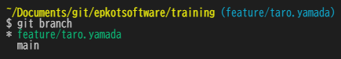

# コーダー編課題

コーダー編の課題を以下にアップしましょう。

- ブランチ名: `feature/{★ユーザー名}`
- 提出先パス: [`users/{★ユーザー名}/01_beginner/htdocs/`](./htdocs/)

## ブランチ確認方法

以下のコマンドで確認できます。  
「`*`」がついているブランチ名が現在のブランチです。

```bash
git branch
```

Git Bash を使用している場合はディレクトリパスの後ろに「`(ブランチ名)`」が表示されます。


