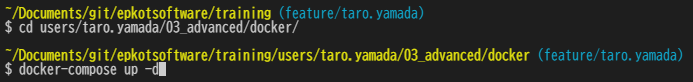

# フロントエンドエンジニア編課題

フロントエンドエンジニア編の課題を以下にアップしましょう。

- ブランチ名: `feature/{★ユーザー名}`
- 提出先パス: [`users/{★ユーザー名}/03_advanced/htdocs/`](./htdocs/)

## PHP開発環境

CBCではMAMP、XAMPPを使用して環境を作っていますが  
Dockerを使って環境を構築します。  
PHPのDB接続設定等も異なりますのでご注意ください。

### Docker

Dockerインストール後に [03_advanced/docker/docker-compose.yml](./docker/docker-compose.yml) があるディレクトリに  
`cd {ディレクトリパス}` コマンドで移動して  
`docker-compose up -d` コマンドを実行します。

```bash
# カレントディレクトリを docker-compose.yml と同じディレクトリにして実行。
cd 03_advanced/docker/
docker-compose up -d
```

- メールアドレス `"taro.yamada@epkotsoftware.co.jp"` の例
  - 

#### 確認

- WEB ([htdocs](./htdocs/) 内に置いてあるPHPファイルが実行されます。)
  - <http://localhost:8001/index.php>
  - <http://localhost:8001/sortable/index.php>
  - <http://localhost:8001/sortable2/index.php>
  - <http://localhost:8001/sortable3/index.php>
- phpMyAdmin
  - <http://localhost:8888>

#### 使用しているイメージについて

phpMyAdmin については必須ではありませんが  
CBCの研修内容にあわせて追加しています。

- PHP (`php:<version>-apache`)
  - <https://hub.docker.com/_/php?tab=tags>
- MySQL
  - <https://hub.docker.com/_/mysql?tab=tags>
- phpMyAdmin
  - <https://hub.docker.com/r/phpmyadmin/phpmyadmin/tags>

### SQLクライアント

無料、汎用的に使える、SQL自動生成、ER図作成等も出来る `A5:SQL Mk-2` がおすすめです。

- `A5:SQL Mk-2`
  - <https://a5m2.mmatsubara.com/>
- 接続情報
  - ホスト名: `localhost`
  - ユーザーID: `root`
  - パスワード: `root`
  - ポート番号: `3306`

## PHP

PDO設定

```php
define('DB_DNS', 'mysql:host=mysql; dbname={★DB名}; charset=utf8');
define('DB_USER', 'root');
define('DB_PASSWORD', 'root');

$dbh = new PDO(DB_DNS, DB_USER, DB_PASSWORD);
```

## 操作

### WEB Server

PHPをコマンドで実行してみたり、Linuxのコマンド練習等に使える。

```bash
docker exec -it training-php bash
```

### DB Server

MySQL をコマンドで実行可能。

- コマンドオプションを使用した MySQL Server への接続
  - <https://dev.mysql.com/doc/refman/8.0/ja/connecting.html>

```bash
docker exec -it training-mysql bash
```

```bash
mysql -u root -proot
```
